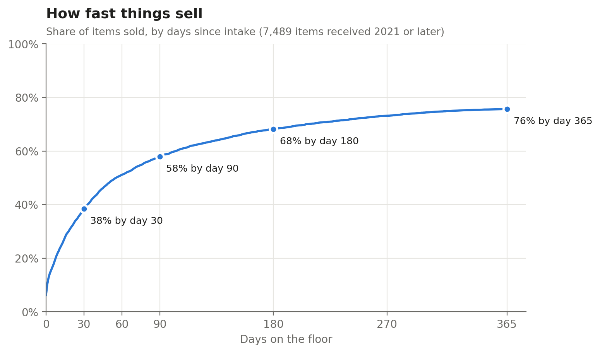
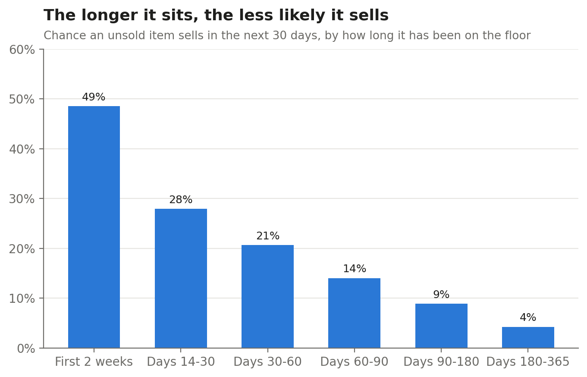
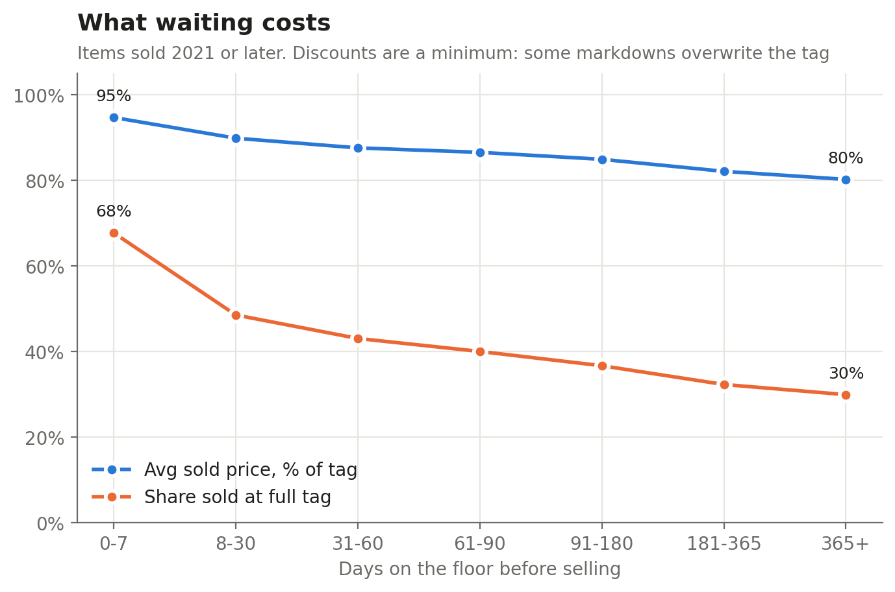
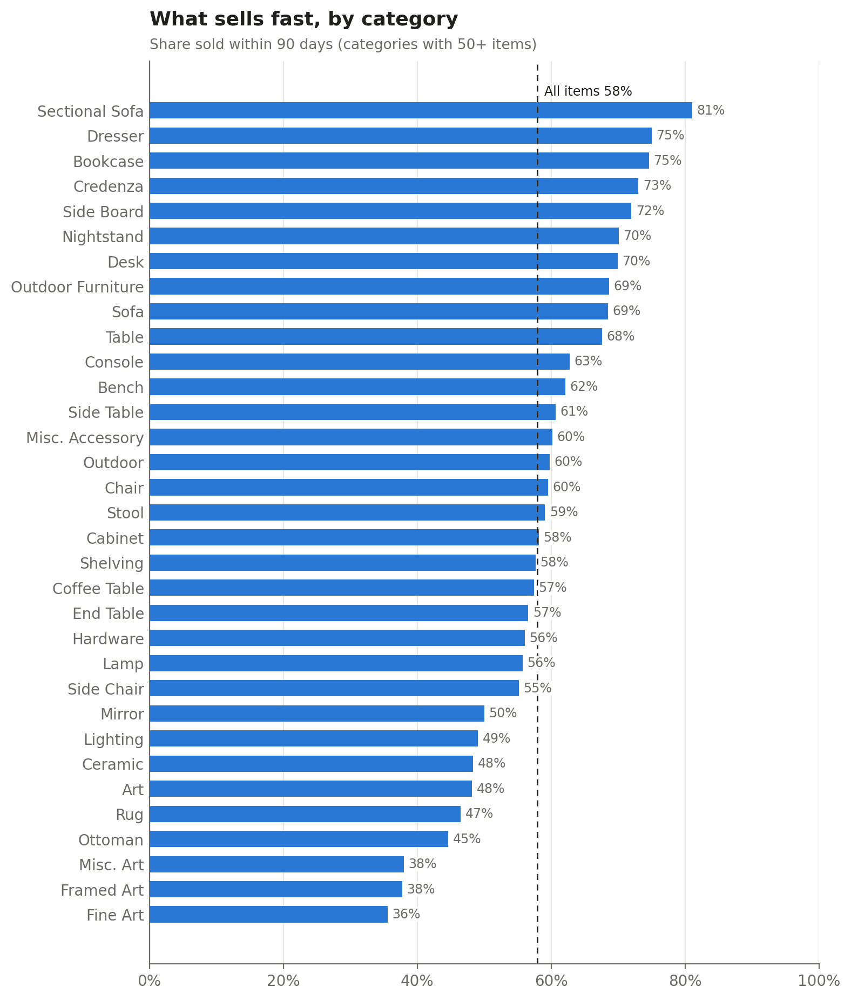
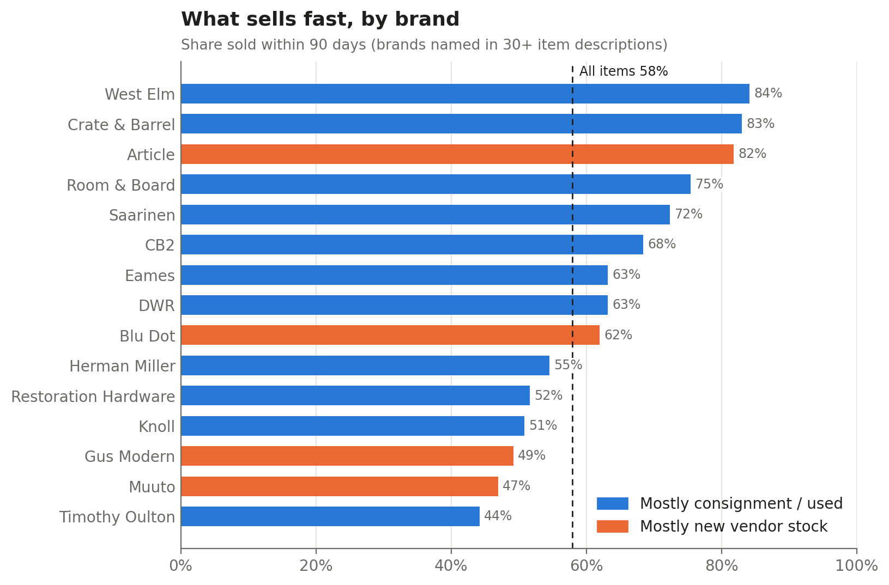

# Consignment Furniture: Pricing and Time-to-Sell Analysis

## Overview

I wanted to know what actually sells at the store I work at, and how long it takes. The short answer: an item's best shot is its first month. Almost 4 in 10 pieces sell in 30 days. After six months on the floor the odds drop to about 4% a month, and the longer something sits, the less of its tag it brings in.

The store is a furniture and antiques consignment shop where I run e-commerce and operations, so I see what sits on the floor every day. I've left its name out. For this project I pulled 17 years of point-of-sale data out of Liberty Consignment POS (85,436 rows, 2009 to September 2026) and tried to answer two questions:

1. How fast do things sell, and what does waiting cost in price?
2. Can we predict sale price and time to sell when an item comes in? (next project)

I cleaned the data in Python, checked my main numbers in SQL, made the charts in matplotlib, and built a simple dashboard so the owner could see the results.

## Data and method

Most of the numbers below use the 7,489 items that came in from January 2021 on and have had at least a year to sell. I started at 2021 so the results reflect how the store runs now, not how it ran in 2010.

Getting there took more cleaning than I expected.

The export has a row when an item gets entered, plus a row every time it's sold or refunded, so first I collapsed it to one row per item. That took 85,436 rows down to 39,048 items. Then I dropped entries that would throw things off: multi-quantity entries (one had over 2,500 sales on it), items with no price, and anything marked "Needs Info". That left 32,476 items across all 17 years.

An item counts as sold if its sales minus refunds is more than zero, using the last sale. That way something that got rung up, refunded and rung up again only counts once. I also split items by where they came from: owned by the store, consigned, or new stock bought wholesale from a vendor.

To check my work, I loaded the clean data into SQLite and rewrote the main counts and rates as SQL queries. A short script compares each query to the Python result and flags anything that doesn't match. This was my first time writing SQL, and it caught a few of my own mistakes along the way.

One thing I had to be careful about: the raw export has consignor names, and some item descriptions have customer phone numbers and emails in them. So consignor IDs are hashed, names are dropped, and none of the row-level data is public. The repo only has code and charts.

Tools: Python (pandas, matplotlib) and SQL (SQLite).

## Finding 1: the first month matters most

Almost 4 in 10 pieces (38%) sell in their first 30 days. Things keep selling after that, just a lot slower: 58% are gone by day 90 and 76% by the end of the year.

The second chart looks at it a different way. If an item is still on the floor, what are the odds it sells in the next 30 days? In the first two weeks, items sell at a pace of about 49% a month. In the next two weeks that drops to 28%. Once a piece has been sitting for more than 180 days, it's down to 4% a month.

For the store, this means that if something hasn't sold by around 60 to 90 days, it probably won't sell soon at that price. That's the point to mark it down, move it somewhere else on the floor, or have a conversation with the consignor.

## Finding 2: waiting costs money

The longer an item sits, the less of its tag it brings in. Things that sell in the first week go for 95% of tag on average. After a year it's about 80%. This is mostly discounting.

Full-price sales fall off even faster. In the first week, 68% of items sell at full tag. After a year, only 30% do.

This is based on 6,954 items sold since 2021. The typical tag price is about the same in every group, so it isn't just cheap stuff selling first. And these discounts are the minimum, for reasons I get into under Gaps.

## Finding 3: what sells fastest

Big furniture sells fastest and art sells slowest. Sectionals were the top category, with 81% sold within 90 days, compared with 58% for everything. Dressers, bookcases, credenzas and sideboards were all over 70%.

Fine art, framed art and misc. art were all under 40% within 90 days. Rugs, ottomans, ceramics and lighting were under 50% too. Most of the art is consigned (79% to 98%), so it's mainly consignors' pieces sitting, not the store's. That lines up with what the owner already does: he rarely buys art for the store because it doesn't move on the floor.

Price mattered less than I expected. Across most price ranges, items sell at about the same rate (54% to 61% within 90 days). Only the most expensive pieces are slower: 27% sell in the first 30 days, compared with about 40% for everything else. Cheaper items also hold their tag better: the cheapest pieces sell for 94% of tag on average, the most expensive for 85%.

For brands, the mainstream contemporary names sell fastest: West Elm 84%, Crate & Barrel 83%, Article 82% and Room & Board 75% within 90 days. Timothy Oulton, Muuto, Gus Modern, Knoll and Restoration Hardware were all around 50% or lower. Article, Blu Dot, Gus and Muuto are mostly new vendor stock, not consignment (orange in the chart).

One catch with brands: I tagged them by searching item descriptions for the brand name, so a piece only counts if whoever entered it wrote the brand down. I only show brands that came up in 30+ items.

## Gaps: what the data can't see

There were of course some gaps in this data.

The biggest one is that some very high-ticket items sold off the floor, through auctions, never go through Liberty. So some of the best finds in the store's history aren't in here. The art numbers above describe art on the floor, not what art is worth to the business.

Markdowns sometimes change the tag. When a tag price gets lowered in the system, the original price vanishes. Other times the discount happens at the register and the original price stays. Either way, the discounts shown in the data are the minimum.

Some pieces are entered at the register. This is often because the item sold so soon after it came in that there wasn't time to print a tag. For those I don't know how long they were really on the floor, so anything sold within 15 minutes of being entered is left out of the timing numbers.

Some bulk buys (multi-quantity entries) are excluded, and pieces that were never closed out in the system count as unsold, which probably makes the sell rates a little low. A few vendor and store accounts are also labeled as consignors in the system. I fixed the ones I could identify, but since a few could still be wrong, I didn't compare consigned items to store-owned ones.

## What happened next

I shared these findings with the owner. He's going to focus more on the fastest-selling categories when he's sourcing, and be even pickier about the slow ones.

To see if that actually changes anything, I'm tracking it against a baseline. For the last three years, about 20% of what came in each year was from the fast categories (sectionals, sofas, dressers, bookcases, credenzas, sideboards, nightstands and desks) and about 20% was from the slow ones (art, rugs, ottomans, ceramics, lighting and mirrors). I'll check intake again in December, and sell-through at 30 and 90 days in February.

After that, the next project is a price predictor: using the same clean data to estimate what an item will sell for, and how long it'll take, when it first comes in.

## Running it

Scripts run from the project folder, in this order: `src/clean.py`, `src/time_to_sell.py`, `src/price_vs_time.py`, `src/breakdown.py`, `src/plots.py`. The raw Liberty export is not included.
